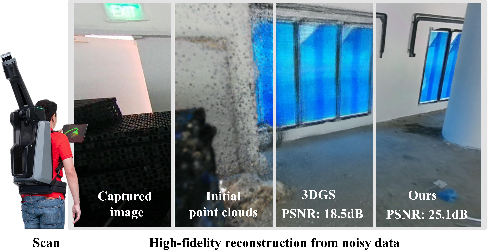

# A Constrained Optimization Approach for Gaussian Splatting from Coarsely-posed Images and Noisy Lidar Point Clouds
[Jizong Peng*](https://scholar.google.com/citations?user=s6JKJSymFFsC&hl=en), [Tze Ho Elden Tse*](https://eldentse.github.io/), [Kai Xu](https://kai422.github.io/), [Wenchao Gao](https://ieeexplore.ieee.org/author/38265568800), [Angela Yao](https://www.comp.nus.edu.sg/~ayao/) (* indicates equal contribution)

[[Project page]]() [[arXiv]]() [[Data]]() 

<p align="center">

</p>

## Abstract
3D Gaussian Splatting (3DGS) is a powerful reconstruction technique, but it needs to be initialized from accurate camera poses and high-fidelity point clouds. Typically, the initialization is taken from Structure-from-Motion (SfM) algorithms; however, SfM is time-consuming and restricts the application of 3DGS in real-world scenarios and large-scale scene reconstruction. We introduce a constrained optimization method for simultaneous camera pose estimation and 3D reconstruction that does not require SfM support. Core to our approach is decomposing a camera pose into a sequence of camera-to-(device-)center and (device-)center-to-world optimizations. To facilitate, we propose two optimization 
constraints conditioned to the sensitivity of each parameter group and restricts each parameter's search space. In addition, as we learn the scene geometry directly from the noisy point clouds, we propose geometric constraints to improve the reconstruction quality. Experiments demonstrate that the proposed method significantly outperforms the existing (multi-modal) 3DGS baseline and methods supplemented by COLMAP on both our collected dataset and two public benchmarks.

## Citation

If you find this code useful in your research, please consider citing:

```bibtex
@inproceedings{peng2025constrained,
  title={A Constrained Optimization Approach for Gaussian Splatting from Coarsely-posed Images and Noisy Lidar Point Clouds},
  author={Peng, Jizong and Tse, Tze Ho Elden and Xu, Kai and Gao, Wenchao and Yao, Angela},
  journal={ICCV},
  year={2025}
}
```