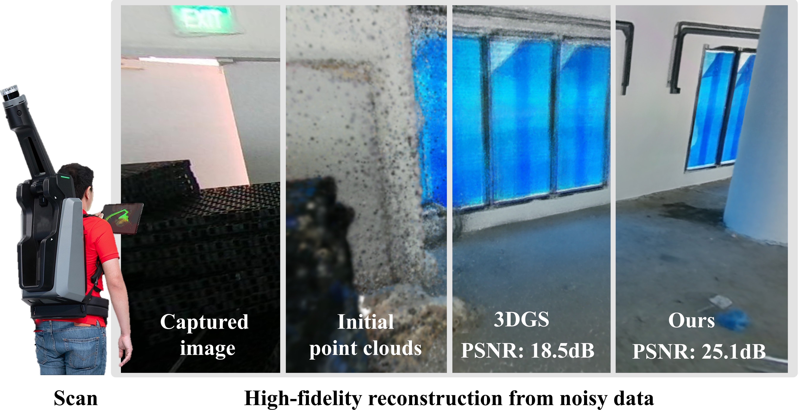

# A Constrained Optimization Approach for Gaussian Splatting from Coarsely-posed Images and Noisy Lidar Point Clouds
[Jizong Peng*](https://scholar.google.com/citations?user=s6JKJSymFFsC&hl=en), [Tze Ho Elden Tse*](https://eldentse.github.io/), [Kai Xu](https://kai422.github.io/), [Wenchao Gao](https://ieeexplore.ieee.org/author/38265568800), [Angela Yao](https://www.comp.nus.edu.sg/~ayao/) (* indicates equal contribution)

[[Project page]](https://eldentse.github.io/contrained-optimization-3dgs/) [[arXiv]](https://arxiv.org/pdf/2504.09129) [[Data]](https://drive.google.com/file/d/1X4olWL1xD__2sUL0CIay13kqIepllrVu/view?usp=sharing) 

<p align="center">

</p>

## Abstract
3D Gaussian Splatting (3DGS) is a powerful reconstruction technique, but it needs to be initialized from accurate camera poses and high-fidelity point clouds. Typically, the initialization is taken from Structure-from-Motion (SfM) algorithms; however, SfM is time-consuming and restricts the application of 3DGS in real-world scenarios and large-scale scene reconstruction. We introduce a constrained optimization method for simultaneous camera pose estimation and 3D reconstruction that does not require SfM support. Core to our approach is decomposing a camera pose into a sequence of camera-to-(device-)center and (device-)center-to-world optimizations. To facilitate, we propose two optimization 
constraints conditioned to the sensitivity of each parameter group and restricts each parameter's search space. In addition, as we learn the scene geometry directly from the noisy point clouds, we propose geometric constraints to improve the reconstruction quality. Experiments demonstrate that the proposed method significantly outperforms the existing (multi-modal) 3DGS baseline and methods supplemented by COLMAP on both our collected dataset and two public benchmarks.

## ⚠️ Important Notice Regarding Code Release

Due to ongoing patent processing, we are not yet able to release the full implementation of our proposed method. However, we will be releasing a **simplified version** very soon. Thank you for your patience!

---

## 📁 Dataset Structure
We provide datasets for three distinct indoor scenes: **Cafeteria**, **Laboratory**, and **Office**. Each scene is captured using a 4-camera rigged setup. [Link to dataset download](https://drive.google.com/file/d/1X4olWL1xD__2sUL0CIay13kqIepllrVu/view?usp=sharing)

For each scene, the folder is structured as follows (using `cafeteria` as an example):

```text
📦 cafeteria
 ┣ 📂 images/                     # Raw image data
 ┃ ┣ 📂 <camera_1_id>           # Images from Camera 1
 ┃ ┣ 📂 <camera_2_id>             # Images from Camera 2
 ┃ ┣ 📂 <camera_3_id>             # Images from Camera 3
 ┃ ┗ 📂 <camera_4_id>             # Images from Camera 4
 ┣ 📂 sparse/                     # Baseline COLMAP reconstruction
 ┃ ┣ 📜 cameras.txt
 ┃ ┣ 📜 images.txt
 ┃ ┣ 📜 points3D.ply
 ┃ ┗ 📜 points.txt
 ┣ 📂 sparse_refined/             # Rig-constrained COLMAP reconstruction
 ┃ ┣ 📜 cameras.txt
 ┃ ┣ 📜 images.txt
 ┃ ┗ 📜 points3D.ply
 ┗ 📜 cafeteria.ply               # Pre-trained 3DGS using our proposed method
```

### 📝 Directory Details

* **`images/`**: Contains the raw capture frames separated into subfolders for each of the 4 cameras on the rig.
* **`sparse/`**: Standard Structure-from-Motion (SfM) outputs generated by COLMAP. This reconstruction does *not* factor in the physical constraints of our camera rig.
* **`sparse_refined/`**: Improved SfM outputs generated by running COLMAP with our **rigged setup prior**. By enforcing rigid relative poses between the cameras, this folder provides much more stable camera intrinsics (focal lengths) and more accurate extrinsics. **We highly recommend using this folder for downstream tasks.**
* **`<scene_name>.ply`**: The final 3D Gaussian Splatting point cloud trained using our proposed method. You can load this directly into any standard Gaussian Splatting viewer.

## 🚀 How to Use the Data

**1. Viewing the Pre-trained Model:**
To visualize the results immediately, you can drag and drop the `cafeteria.ply` (or `laboratory.ply`, `office.ply`) into standard WebGL Gaussian Splatting viewers (such as [SuperSplat](https://playcanvas.com/supersplat/editor) or the official Inria viewer).

**2. Training Your Own Models:**
If you wish to train your own NeRF or Gaussian Splatting models using our data, point your training script to the `sparse_refined` directory to utilize the most accurate camera poses:


**3. Running Custom SfM:**
If you want to run your own custom photogrammetry or SfM pipeline from scratch, you can ignore the `sparse*/` folders entirely and use the multi-camera image streams provided in the `images/` directory.


## Citation

If you find this code useful in your research, please consider citing:

```bibtex
@inproceedings{peng2025constrained,
  title={A Constrained Optimization Approach for Gaussian Splatting from Coarsely-posed Images and Noisy Lidar Point Clouds},
  author={Peng, Jizong and Tse, Tze Ho Elden and Xu, Kai and Gao, Wenchao and Yao, Angela},
  journal={ICCV},
  year={2025}
}
```